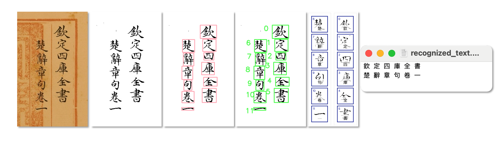

# 历史文档OCR项目


本项目提供了一个端到端的解决方案，用于历史文档的光学字符识别（OCR）。它基于 Python 和 Flask 开发，集成了深度学习技术，包括 HRCenterNet 用于字符分割，以及基于 CNN 的字符识别系统，并通过 BERT 优化提升准确性。系统能够处理图像、提取文本，并提供一个便于交互的网页界面。

## 功能

- **图像预处理**：对灰度图像进行二值化以增强字符检测效果。
- **字符分割**：使用 HRCenterNet 进行无锚点的字符边界框检测。
- **字符识别**：采用 CNN 模型预测字符，并提供前 K 个预测结果。
- **BERT 优化**：利用 BERT 的上下文分析优化 OCR 结果。
- **网页界面**：基于 Flask 的前端，支持上传图像、查看结果和下载识别文本。



## 安装

1. **克隆仓库**：

```bash
git clone https://github.com/binarymars/historical-ocr-project.git
cd historical-ocr-project
```

2. **创建虚拟环境**（可选但推荐）：

```bash
python -m venv ocr-env
source ocr-env/bin/activate  # Windows 上：ocr-env\Scripts\activate
```

3. **安装依赖**：

```bash
pip install -r requirements.txt
```

4. **下载预训练模型**：

将 HRCenterNet 权重文件（[`HRCenterNet.pth.tar`](https://drive.google.com/file/d/1noPhjYcV09fTSPZHPjXAHzJ2gtwa57Wu/view?usp=share_link)）放入 `models/hrcenternet/`。
将 CNN 权重文件（[`best.weights.h5`](https://drive.google.com/file/d/1tTMdS7svNjS1huOh_21epi6bcbCHQF7y/view?usp=share_link)）和字符字典（[`w2i.json`](https://drive.google.com/file/d/1c7kiyZbjQ_AQdtmYxLQ6huX03drLRX8M/view?usp=share_link)）放入 `models/cnn/`。

5. **运行应用**（初次运行需要一些时间）：

```bash
python app.py
```

6. 打开浏览器，访问 `http://127.0.0.1:5000`。

## 使用方法

1. **上传图像**：

- 通过网页界面上传历史文档图像（支持 PNG、JPG 或 JPEG 格式）。

2. **查看结果**：

- 系统处理图像后，显示分割后的列、单个字符及预测文本。
- 中间结果图像（例如二值化、排序后的边界框）保存在 `static/results/` 文件夹中。

3. **下载文本**：

- 点击下载按钮，将识别的文本保存为 `.txt` 文件。

4. **命令行运行**（可选）：

```bash
python main_ocr.py --input 图像路径.jpg --output 输出路径.json`
```

## 依赖

本项目依赖以下 Python 库（具体版本见 `requirements.txt`）：

- Flask：用于网页界面的框架。
- NumPy、OpenCV、Pillow、scikit-image、SciPy：图像处理与操作。
- TensorFlow、PyTorch、Torchvision：深度学习框架，用于模型推理。
- Transformers：基于 BERT 的优化。
- Matplotlib：可视化工具。

安装命令：

```
pip install -r requirements.txt
```

## 项目结构

```text

historical-ocr-project/
├── README.md
├── app.py              # Flask 应用
├── main_ocr.py         # 核心 OCR 处理脚本
├── models/             # 预训练模型权重
│   ├── cnn/
│   │   ├── best.weights.h5       # 自行导入
│   │   └── w2i.json              # 自行导入
│   └── hrcenternet/
│       └── HRCenterNet.pth.tar   # 自行导入
├── templates/          # HTML 模板
│   └── index.html
├── requirements.txt    # 依赖列表
├── static/             # 静态文件（上传、结果）
│   ├── fonts
│   ├── icons
│   ├── results
│   └── uploads
└── utils/              # 工具函数（二值化、检测等）
    ├── bert_optimize.py
    ├── binarize_image.py
    ├── hrcenternet.py
    ├── optimize_bboxes.py
    ├── predict_character.py
    └── sort_bboxes.py
```

## 致谢

本项目基于以下研究和数据集开发：

- **HRCenterNet**：一种用于历史文档中汉字分割的无锚点方法。
引用：

```bibtex
@INPROCEEDINGS{9378051,  
  author={C. -W. {Tang} and C. -L. {Liu} and P. -S. {Chiu}},  
  booktitle={2020 IEEE International Conference on Big Data (Big Data)},   
  title={HRCenterNet: An Anchorless Approach to Chinese Character Segmentation in Historical Documents},   
  year={2020},  
  pages={1924-1930},  
  doi={10.1109/BigData50022.2020.9378051}
}
```

- **CASIA-AHCDB**：大规模中文古籍手写字符数据库。
引用：

```bibtex
@INPROCEEDINGS{,  
  author={Yue Xu and Fei Yin and Da-Han Wang and Xu-Yao Zhang and Zhaoxiang Zhang and Cheng-Lin Liu},  
  booktitle={Proc. 15th International Conference on Document Analysis and Recognition (ICDAR)},  
  title={CASIA-AHCDB: A Large-Scale Chinese Ancient Handwritten Characters Database},  
  year={2019},  
  pages={793-798},  
  address={Sydney, Australia},  
  month={September}
}
```

- **SikuBERT**：面向数字人文的《四库全书》预训练模型。
引用：

```bibttex
王东波, 刘畅, 朱子赫, 等. SikuBERT与SikuRoBERTa：面向数字人文的《四库全书》预训练模型构建及应用研究[J]. 图书馆论坛, 2022, 42(06): 31-43.
```

- **ACD算法**：针对中国历史文献独特结构排序的算法。
引用：

```bibtex
Lee A, Yu H Y, Min G. An algorithm of line segmentation and reading order sorting based on adjacent character detection: a post-processing of ocr for digitization of chinese historical texts[J]. Journal of Cultural Heritage, 2024, 67: 80-91.
```
